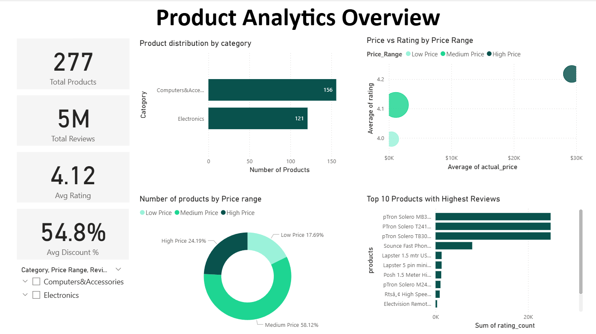
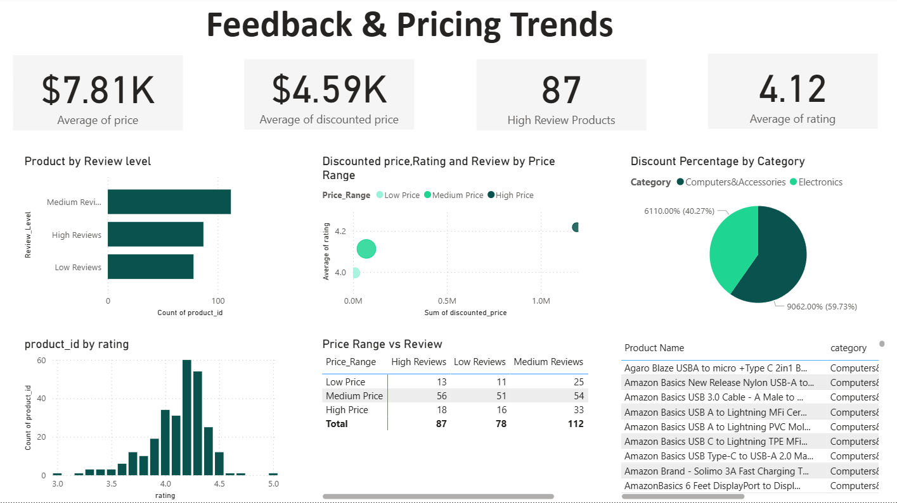
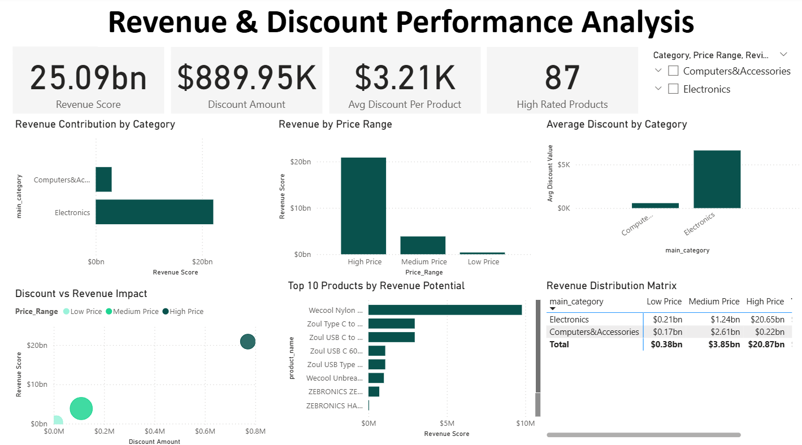

# Amazon Product Analytics Dashboard

## 📌 Project Overview

This project analyzes Amazon product data to uncover pricing trends, customer behavior patterns, and revenue insights. Data was cleaned using SQL and visualized using Power BI dashboards.

The dashboards provide insights into product distribution, pricing strategies, customer ratings, and revenue potential across categories.

---

## 📊 Dashboards

### Dashboard 1 — Product Analytics Overview

Includes:
- Product distribution by category
- Price range segmentation
- Rating trends
- Top reviewed products

---

### Dashboard 2 — Feedback & Pricing Trends

Includes:
- Review-level distribution
- Rating histogram
- Discount analysis
- Price vs rating insights

---

### Dashboard 3 — Revenue & Discount Performance Analysis

Includes:
- Revenue contribution by category
- Revenue by price range
- Discount impact analysis
- Revenue distribution matrix

---

## 🛠 Tools Used

- SQL (MySQL)
- Power BI
- DAX
- Excel

---

## 📈 Key Insights

- High-price products generate the highest revenue.
- Electronics category contributes the largest revenue share.
- Discounts significantly impact revenue potential.
- Most products maintain strong ratings above 4.0.

---

## 📂 Dataset

Amazon Product Dataset including:

- product_name  
- category  
- actual_price  
- discounted_price  
- rating  
- rating_count  

---

## 📊 Dashboard Preview

### Dashboard 1 — Product Analytics Overview

### Dashboard 2 — Feedback & Pricing Trends

### Dashboard 3 — Revenue & Discount Performance Analysis

---

## Business Questions Solved

- Which product categories generate the highest revenue?
- How do discounts impact revenue potential?
- What price range dominates product distribution?
- Which products receive the highest customer engagement?
- How does rating vary across price ranges?

  ---
## 📌 Author

Mohammed Jasim
Data Analyst Portfolio Project
